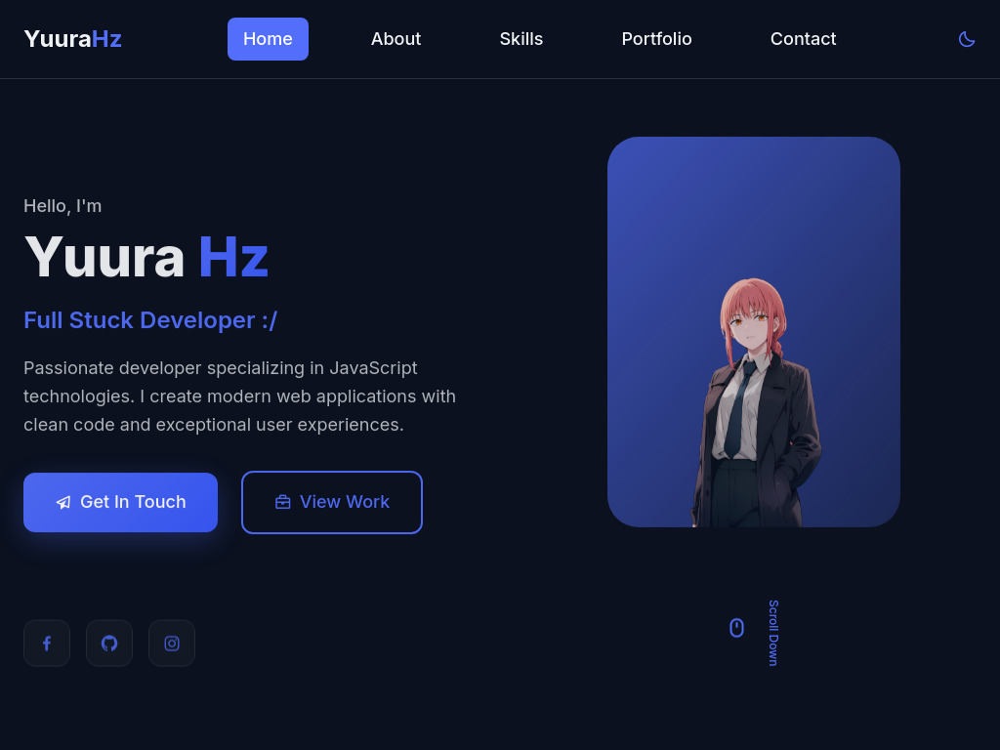

# 🌟 Personal Portfolio — YuuraHz

<div align="center">
  
</div>

<p align="center">
  <a href="https://github.com/yuurahz/portofolio/stargazers">
    
  </a>
  <a href="https://github.com/yuurahz/portofolio/network/members">
    
  </a>
  <a href="https://github.com/yuurahz/portofolio/issues">
    
  </a>
  <a href="https://github.com/yuurahz/portofolio/blob/main/LICENSE">
    
  </a>
</p>

---

## 🚀 Tentang Proyek

Website **Personal Portfolio** ini adalah representasi digital dari karya, skill, dan perjalanan saya sebagai developer. Dibangun dengan desain modern dan responsif, website ini memberikan pengalaman visual yang memukau sekaligus navigasi yang mudah.

## ✨ Fitur Unggulan

| Fitur                      | Deskripsi                               |
| -------------------------- | --------------------------------------- |
| 🌗 **Light & Dark Mode**   | Pilihan tema sesuai kenyamanan pengguna |
| 📱 **Responsive Design**   | Tampil optimal di semua ukuran layar    |
| ⚡ **Loading Cepat**       | Optimisasi gambar & asset               |
| 🎨 **UI/UX Modern**        | Desain bersih dan estetik               |
| 🛠 **Mudah Dikustomisasi** | Struktur kode sederhana & rapi          |

---

## 🛠️ Teknologi yang Digunakan


---

## 📦 Cara Menjalankan Secara Lokal

```bash
# 1. Clone repository
git clone https://github.com/yuurahz/portofolio.git

# 2. Masuk ke folder project
cd portofolio

# 3. Jalankan di browser
serve
```

---
